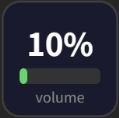
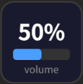
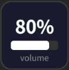

# OpenDeck - Dynamic MultiOS Volume Display

An OpenDeck Plugin to display volume state for Linux/macOS/Windows.

   

Displays the current system output volume percentage on a Stream Deck key with a colour-coded bar. When the system is muted a "MUTE" indicator is shown instead.

## Installation

### Via OpenDeck Plugin Manager (recommended)

1. Open OpenDeck and go to the **Plugins** tab in Settings.
2. Click **Install from URL** and paste:
   ```
   https://github.com/aiya000/opendeck-plugin-multios-volume-display
   ```
   Or download the latest `io.github.aiya000.multios-volume-display.zip` from the [Releases](../../releases/latest) page and install it from the Plugins tab.

### Manual installation

1. Download `io.github.aiya000.multios-volume-display.zip` from the [Releases](../../releases/latest) page.
2. Extract it into your OpenDeck plugins directory:
   - **Linux**: `~/.local/share/opendeck/plugins/io.github.aiya000.multios-volume-display/`
   - **Windows**: `%appdata%\opendeck\plugins\io.github.aiya000.multios-volume-display\`
   - **macOS**: `~/Library/Application Support/opendeck/plugins/io.github.aiya000.multios-volume-display/`
3. Restart OpenDeck.

## Requirements

- [Deno](https://deno.com/) must be installed on the system running the plugin.
- **Linux**: `pactl` (provided by PulseAudio or PipeWire's PulseAudio compatibility layer).
- **macOS**: `osascript` (built-in).
- **Windows**: PowerShell (built-in).
